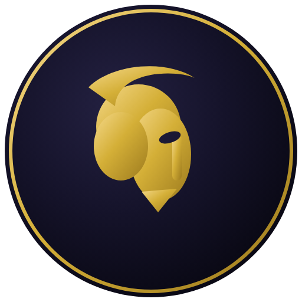

<p align="center">
  
</p>

# Némésis

Bot Discord de statistiques **League of Legends** écrit en Python (discord.py + riotwatcher).
La commande `!stats Pseudo#TAG` affiche niveau, rang, winrate et dernières parties d'un joueur.

## Prérequis

- [uv](https://docs.astral.sh/uv/) pour la gestion du projet.
- Python **3.14+** (installé automatiquement par uv si besoin).

## Obtenir les deux clés

1. **Token Discord** — [Portail développeur Discord](https://discord.com/developers/applications) :
   créez une application, ajoutez un bot, copiez son token.
2. **Clé API Riot** — [developer.riotgames.com](https://developer.riotgames.com/) :
   récupérez une clé de développement. ⚠️ Elle **expire toutes les 24 h** (un code 403
   signifie qu'il faut la régénérer).

## Activer l'intent « Message Content »

Dans le portail Discord : votre application → **Bot** → **Privileged Gateway Intents** →
activez **Message Content Intent**. Sans cela, le bot ne lira pas les commandes texte.

## Installation

```bash
# Copier la config et renseigner les secrets
cp .env.example .env   # puis éditer .env

# Installer les dépendances
uv sync
```

## Lancer le bot

```bash
uv run python -m nemesis
```

## Utilisation

Dans un salon où le bot est présent :

```
!stats Faker#KR1
```

## Développement

```bash
uv run ruff format .     # formatage
uv run ruff check --fix  # lint + corrections automatiques
```
